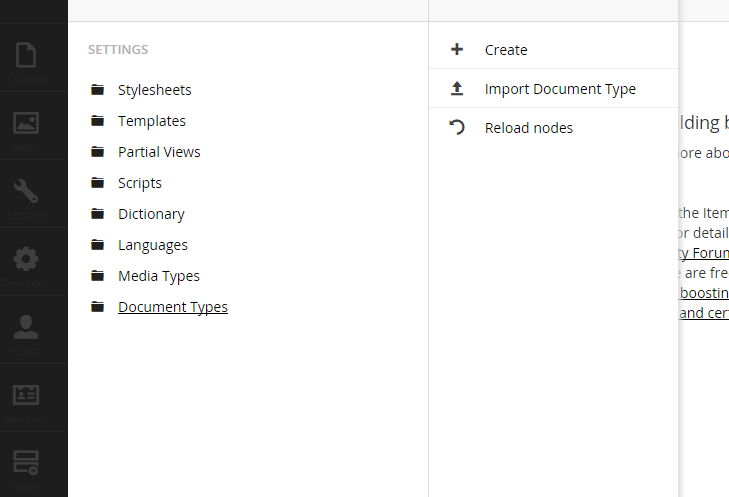
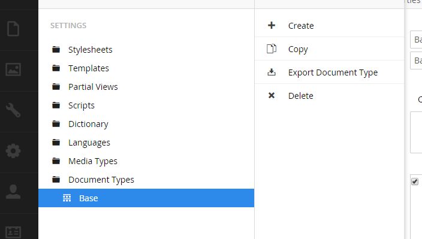
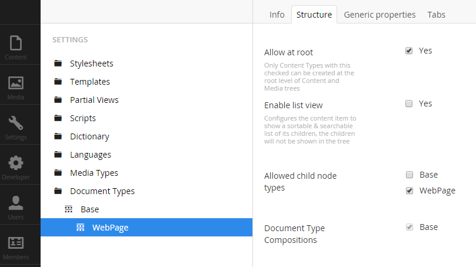
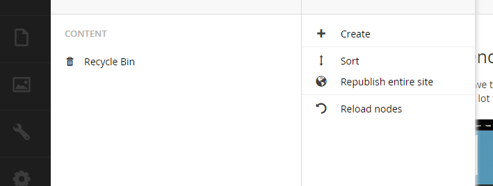
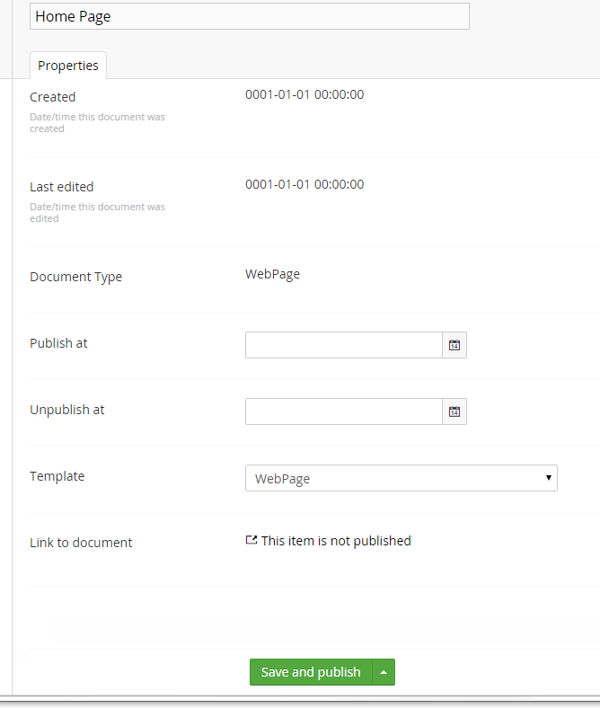
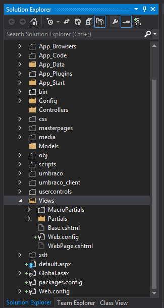
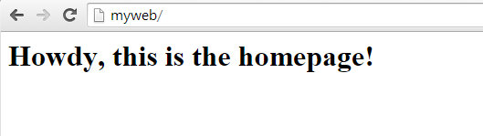

# Umbraco Developer Tutorials

## Beginner Umbraco tutorials for developers

### Tutorial 2 - Creating a Webpage
This is Tutorial two in a series of beginner tutorials for Umbraco 7, that create a custom form
in Umbraco.

*   [Tutorial 1 - How to setup Umbraco 7 with Visual Studio](Tutorial-1-Umbraco7-Setup.md)
*   [Tutorial 2 - Creating a webpage](Tutorial-2-Creating-a-Webpage.md)
*   [Tutorial 3 - Creating and Storing Data in Umbraco](Tutorial-3-Storing-Data-in-Umbraco.md)
*   [Tutorial 4 - Creating a Custom Form in Umbraco](Tutorial-4-Creating-a-Custom-Form.md)
*   [Tutorial 5 - Adding a Member-side "Admin"](Tutorial-5-Adding-a-Member-Side-Admin.md)

#### Creating the Document Type

Now we are going to create a web page in the root of the site and make a change to the view file.

In the Umbraco admin, on the left menu click on Settings.

Right click on Document Types and select Create.

Give you Type a name like Base. This will be the root document type node which we will create other document types off of for organizational purposes.

Right Click on the new Base Document Type and select Create.

Give this new document type a name like WebPage and click create.

Click on the Structure tab for your WebPage Document Type and then
check the box to “Allow at root” and then also check the box for “WebPage”
for “Allowed child node types”

Now it’s time to create the webpage.  Click on the content menu item on the left menu.
Right Click on Content and select Create

Select WebPage for the document type. At the top of the page enter a name for the webpage.
Let's call it Home Page. Click on Save and publish.

Now we have a webpage at the root of our site.  If you go to
[http://myweb](http://myweb) at this point you should see a blank page, let’s add some content.

Back in Visual Studio, under the Solution Explorer make sure you click on the button to
“Show All Files” (it should be the fourth from the right) and then expand the Views folder
and then click the Refresh button (it’s two over from the “Show All Files Button”)

Now you should see 2 new .cshtml view files, one for WebPage and one for Base.
Right click on the Webpage.cshtml file and select “Include in Project”

Next Open up the WebPage.cshtml page and add the following and save:

    <h1>Howdy, this is the homepage!</h1>

Now go back and refresh your browser and this text should now be visible!
You just made your first page and change the view for it!

One thing to keep in mind for the future is that this one view will be
used for all content that you create using the WebPage Document Type.

[Next>> Tutorial 3 - Creating and Storing Data in Umbraco](Tutorial-3-Storing-Data-in-Umbraco.md)
