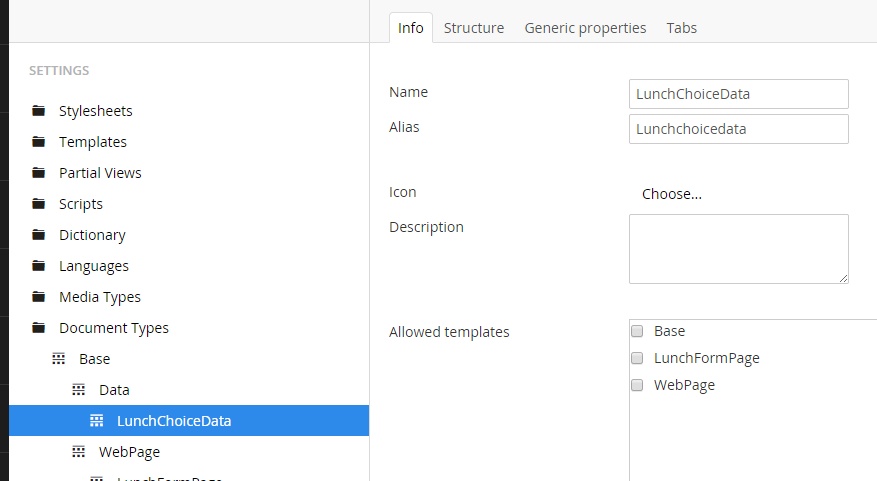
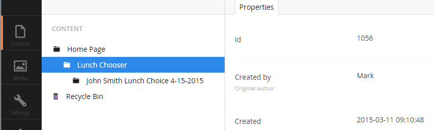
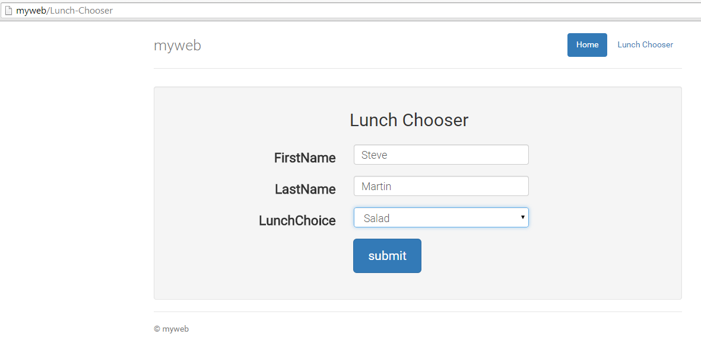
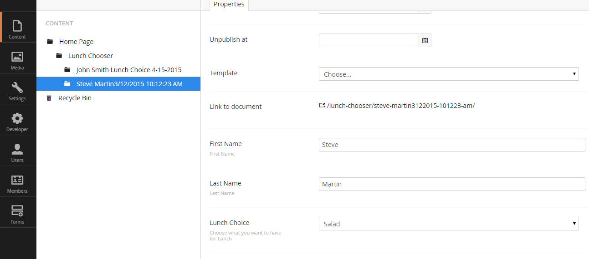

# Umbraco Developer Tutorials

## Beginner Umbraco tutorials for developers

### Tutorial 4 - Creating a Custom Form
This is Tutorial four in a series of beginner tutorials for Umbraco 7, that create a custom form
in Umbraco.

*   [Tutorial 1 - How to setup Umbraco 7 with Visual Studio](Tutorial-1-Umbraco7-Setup.md)
*   [Tutorial 2 - Creating a webpage](Tutorial-2-Creating-a-Webpage.md)
*   [Tutorial 3 - Creating and Storing Data in Umbraco](Tutorial-3-Storing-Data-in-Umbraco.md)
*   [Tutorial 4 - Creating a Custom Form in Umbraco](Tutorial-4-Creating-a-Custom-Form.md)

Now it’s time for us to return to Visual Studio and start doing some coding.  So open up the myweb project in Visual Studio and refresh the Solution Explorer.  You should now see a LunchFormPage.cshtml view under the Views Folder.  Right click this file and select “Include in Project” and then open the file.  Add the following code and save the file.
```
@inherits Umbraco.Web.Mvc.UmbracoTemplatePage
@{
    Layout = "~/Views/_Layout.cshtml";
}

@{
    Html.RenderPartial("~/Views/Partials/_LunchForm.cshtml", new myweb.Models.Lunch());
}
```
In order for this to work we now need to create the _LunchForm partial view and the Lunch model.  Lets start with the Lunch model.  In Visual Studio right click on the Models folder in the Solution Explorer and create a new class file called Lunch.cs.  Enter the following code for your model:
```
using System;
using System.ComponentModel.DataAnnotations;

namespace myweb.Models
{
    public class Lunch
    {
        public int UmbracoID { get; set; }
        public string FirstName { get; set; }
        public string LastName { get; set; }
        public string LunchChoice { get; set; }
    }
}
```
This contains fields for all the properties we created plus a new one, the UmbracoID.  This is a value that is created by Umbraco automatically for each item and in the future we will be able to obtain certain items by their UmbracoID’s so it’s good to have access to it.

Save this file.  Before we return to the form, lets create a layout page using bootstrap so that our form will look presentable.  In the Views folder create a view called _Layout.cshtml, and give it the following code and save, this is a modified template from getbootstrap.com:
```
@{
    Layout = null;
}

&lt;!DOCTYPE html>
&lt;html>
&lt;head>
    &lt;meta charset="utf-8">
    &lt;meta http-equiv="X-UA-Compatible" content="IE=edge">
    &lt;meta name="viewport" content="width=device-width, initial-scale=1">
    &lt;title>myweb&lt;/title>
    &lt;link href="http://ajax.aspnetcdn.com/ajax/bootstrap/3.3.2/css/bootstrap.min.css" rel="stylesheet" />
    &lt;link href="~/css/custom.css" rel="stylesheet" />
    &lt;script src="https://code.jquery.com/jquery-1.11.2.min.js">&lt;/script>
    &lt;link href='http://fonts.googleapis.com/css?family=Roboto:400,100,300' rel='stylesheet' type='text/css'>
&lt;/head>
&lt;body>
    &lt;div class="container">
        &lt;div class="header">
            &lt;nav>
                &lt;ul class="nav nav-pills pull-right" role="navigation">
                    &lt;li role="presentation" class="active">&lt;a href="/">Home&lt;/a>&lt;/li>
                    &lt;li role="presentation">
                        &lt;a href="/Lunch-Chooser" id="LunchForm">
                            Lunch Chooser
                        &lt;/a>
                    &lt;/li>
                &lt;/ul>
            &lt;/nav>
            &lt;h3 class="text-muted main-title">myweb&lt;/h3>
        &lt;/div>
        &lt;div class="well main-content">
            &lt;p class="lead">@RenderBody()&lt;/p>
        &lt;/div>
        &lt;footer class="footer">
            &lt;p>&copy; myweb&lt;/p>
        &lt;/footer>
    &lt;/div>
    &lt;script src="http://ajax.aspnetcdn.com/ajax/bootstrap/3.3.2/bootstrap.min.js">&lt;/script>
&lt;/body>
&lt;/html>
```
The code above is straightforward html with Boostrap built in.  It uses a custom.css file, which we will need to add as well.  In Visual Studio in the Solution Explorer right click on the css folder that is hidden and select “Include in project.”  Right click the css folder and create a new stylesheet called custom.css.  Now, put the following code in the css file, this is a modified CSS file that was taken from getbootstrap.com.
```
/* Space out content a bit */
body {
  padding-top: 20px;
  padding-bottom: 20px;
  font-family: 'Roboto', sans-serif;
}

/* Everything but the jumbotron gets side spacing for mobile first views */
.header,
.marketing,
.footer {
  padding-right: 15px;
  padding-left: 15px;
}

/* Custom page header */
.header {
  border-bottom: 1px solid #e5e5e5;
}
/* Make the masthead heading the same height as the navigation */
.header h3 {
  padding-bottom: 19px;
  margin-top: 0;
  margin-bottom: 0;
  line-height: 40px;
}

/* Custom page footer */
.footer {
  padding-top: 19px;
  color: #777;
  border-top: 1px solid #e5e5e5;
}

/* Customize container */
@media (min-width: 958px) {
  .container {
    max-width: 920px;
  }
}
.container-narrow > hr {
  margin: 30px 0;
}

/* Responsive: Portrait tablets and up */
@media screen and (min-width: 958px) {
  /* Remove the padding we set earlier */
  .header,
  .marketing,
  .footer {
    padding-right: 0;
    padding-left: 0;
  }
  /* Space out the masthead */
  .header {
    margin-bottom: 30px;
  }
  /* Remove the bottom border on the jumbotron for visual effect */
  .well {
    border-bottom: 0;
  }
}

.well {
  text-align: center;
  border-bottom: 1px solid #e5e5e5;
}
.well .btn {
  padding: 14px 24px;
  font-size: 21px;
}
h2 {margin-top:0px;}

.center_div{
    margin: 0 auto;
    width:80% /* value of your choice which suits your alignment */
}

.button-label{
    margin-right:30px;
}

.form-control{
    font-size:80%;
}

.main-content{
    font-size:1.6em;
    font-weight: 300;
    font-family: 'Roboto', sans-serif;
}

.Advising-Form label{
    font-weight: 300;
    font-family: 'Roboto', sans-serif;
}

.main-title {
    font-weight:300;
    font-size:180%;
}

.form-header{
    margin-bottom:25px;
}

.warning-text{
    font-size:80%;
    text-align:left;
    line-height:170%;
}

.help-block{
    font-size:55%;
    text-align:left;
    padding-left:5px;
    padding-right:5px;
}

.field-validation-error {
    color:red;
    font-weight:bold;
    font-size:60%;
    display:block;
    margin-top:5px;
}
```
Now create a new partial view under Views/Partials called  _LunchForm.cshtml view and add the following code to it and save.
```
@using Umbraco.Core.Services
@using myweb.Controllers
@model myweb.Models.Lunch
@{
    Layout = null;
}

@using (Html.BeginUmbracoForm&lt;LunchSurfaceController>("Submit", null, new { @class = "form-horizontal" }))
{
    &lt;div class="container center_div">
        &lt;div class="row col-sm-12">
            &lt;div class="form-header">
                &lt;h2>Lunch Chooser&lt;/h2>
            &lt;/div>
            &lt;div class="form-group">
                @Html.LabelFor(m => m.FirstName, new { @class = "col-sm-4 control-label" })
                &lt;div class="col-sm-6">

                    @Html.TextBoxFor(m => m.FirstName, new { @class = "form-control", placeholder = "First Name" })
                    @Html.ValidationMessageFor(m => m.FirstName)
                &lt;/div>
            &lt;/div>
            &lt;div class="form-group">
                @Html.LabelFor(m => m.LastName, new { @class = "col-sm-4 control-label" })
                &lt;div class="col-sm-6">
                    @Html.TextBoxFor(m => m.LastName, new { @class = "form-control", placeholder = "Last Name" })
                    @Html.ValidationMessageFor(m => m.LastName)
                &lt;/div>
            &lt;/div>
            &lt;div class="form-group">
                @Html.LabelFor(m => m.LunchChoice, new { @class = "col-sm-4 control-label" })
                &lt;div class="col-sm-6">
                    @{
                        List&lt;SelectListItem> items = new List&lt;SelectListItem>();

                        DataTypeService dts = new DataTypeService();
                        int collectionid = dts.GetDataTypeDefinitionByName("Lunch Choices").Id;
                        IEnumerable&lt;string> prevalues = dts.GetPreValuesByDataTypeId(collectionid);

                        foreach (string item in prevalues)
                        {
                            items.Add(new SelectListItem
                            {
                                Text = item,
                                Value = item
                            });
                        }

                        var selectItems = new SelectList(items, "Text", "Value");
                    }
                    @Html.DropDownListFor(m => m.LunchChoice, selectItems, new { @class = "form-control" })
                    @Html.ValidationMessageFor(m => m.LunchChoice)
                &lt;/div>
            &lt;/div>
            &lt;div class="form-group">
                &lt;div class="col-sm-10">
                    &lt;label class="button-label"> &lt;/label>
                    &lt;input type="submit" value="submit" name="submit" class="btn btn-lg btn-primary" />
                &lt;/div>
            &lt;/div>

        &lt;/div>
    &lt;/div>
}
```
You will notice that we are creating the SelectList in the cshtml, it finds the data type for Lunch Choices and then retrieves it’s prevalues and then builds the selectlist.  This is conscious decision which breaks a little from true MVC.  One way you can create an Umbraco form is to do it more like true MVC and create a controller which “hijacks” the routing in Umbraco, however, rather than do it that way in this tutorial we are using Umbraco to create the content page and control the routing and essentially sending our users directly into the view.  At times this is a little easier.  In the future hopefully we will also do a tutorial showing the process of hijacking the route, but for now we will do it this way.

Although we are not hijacking the route, this form does submit to the LunchSurfaceController’s Submit action where we do the processing of the form.  You might notice that there is a red squiggly warning under the LunchSurfaceController reference.  We need to make that.  Lets do that now.  Create a controller in the Controllers folder called LunchSurfaceController.cs and then enter the following code and save the file.
```
using System;
using System.Collections.Generic;
using System.Linq;
using System.Web;
using System.Web.Mvc;
using myweb.Models;
using Umbraco.Web.Mvc;
using Umbraco.Core.Services;
using Umbraco.Core.Models;

namespace myweb.Controllers
{
    public class LunchSurfaceController : SurfaceController
    {

        [HttpPost]
        public ActionResult submit(Lunch lunch)
        {
            //Check to see if the submission is valid
            if (!ModelState.IsValid)
            {
                return CurrentUmbracoPage();
            }

            //get the datatype for the Lunch Choices so we can work with it
            IDataTypeDefinition datatype = Services.DataTypeService.GetDataTypeDefinitionByName("Lunch Choices");
            DataTypeService dts = new DataTypeService();

            //Create a new content item under a given parent (1056)
            var contentService = Services.ContentService;
            var LunchContent = contentService.CreateContent(
                lunch.FirstName + " " + lunch.LastName + DateTime.Now, //Name of the new Lunch Submission content
                1056, //Content Parent - Hardcoding this number is not good practice, we'll cover doing this dynamically later
                "Lunchchoicedata", // the alias of the Document Type we are adding
                0); //the user adding the record, 0 is the admin

            //Get the preValue of selected lunch choice
            //The dropdown on our form only contained the text and not the true value (prevalue),
            //we need to find the prevalue id and enter the prevalue id into Umbraco
            var statusEditor = dts.GetAllDataTypeDefinitions().First(x => x.Name == "Lunch Choices");
            int preValueId = dts.GetPreValuesCollectionByDataTypeId(statusEditor.Id).PreValuesAsDictionary.Where(d => d.Value.Value == lunch.LunchChoice).Select(f => f.Value.Id).First();

            //Set the values of each property so that we can add the new item to Umbraco
            LunchContent.SetValue("firstName", lunch.FirstName);
            LunchContent.SetValue("lastName", lunch.LastName);
            LunchContent.SetValue("lunchChoice", preValueId);

            // publish and save the new content
            contentService.SaveAndPublishWithStatus(LunchContent);

            //Return to the same page
            return CurrentUmbracoPage();
        }
    }
}
```
There are some things to note about the code above, take a look through the comments to see some of the notes.  First notice how this controller inherits from the SurfaceController.  The SurfaceController is a custom MVC controller created by Umbraco.  It can do pretty much what a standard MVC controller can do, but it also has some Umbraco specific abilities as well.

Next, notice that we create a new content item of type Lunchchoicedata under parent 1056.   Lunchchoicedata is the alias for our Document Type.  You can find this by going to the Umbraco admin and clicking on Settings, expanding out the Document Types, and clicking on the LunchChoiceData Document Type, and on the Info tab there is an Alias.  This is the alias for this document type.



With regards to finding the parent, we will rerefence the parent’s content id.  This is not a good way to do this since the content id could be different when we publish our site to a production server.  In a future tutorial we will show how to get this id dynamically but for now to find the content id, go to Content in the Umbraco admin, expand the content Home Page node and click on Lunch Chooser in the Properties tab you should see the Id which will hopefully be 1056 for you, if it’s not you will need to change the number in the code that we have above:



The next thing to notice in the LunchSurfaceController.cs is that we have to get prevalue id of the selected item from the dropdown.  The way the custom dropdown works is that each item in the dropdown has a certain id associated with it.  We have to find this id based on the item that was selected in the dropdown box, then we can insert that id into the Umbraco content we are creating.

That’s pretty much it, after that it just sets the values and save’s and publishes the content.  Make sure you save this file.  Now return to the LunchFormPage.cshtml.

At this point Build your project and then go to the page http://myweb/lunch-chooser  and you should now see this:



Enter in some data like pictured above and click submit.  The page returns back to itself, so it’s hard to tell if anything happened, but you can simply check the Umbraco Admin under Content, then expand Home Page and right click on Lunch Chooser and click Reload Nodes and you should now see a new record with “FirstName LastNameDate Time” click on this record and scroll down and you will be able to see the data that was entered.  In this case, Steve Martin and Salad.



So at this point we have a working form.  It’s not the most user friendly form in the world but it works.  In the next tutorial we will show you how to clean up the form a little bit, and then create a new page which lists all the submissions of the Lunch Chooser form.  In real life this could be used as a way to show people the submissions of the form without requiring them to log into Umbraco and learn the Umbraco Admin.
