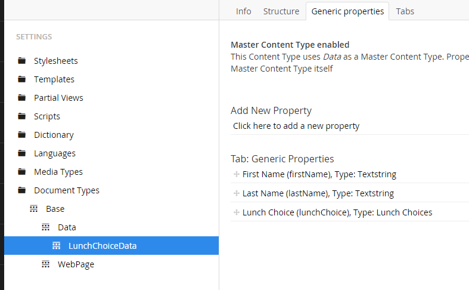
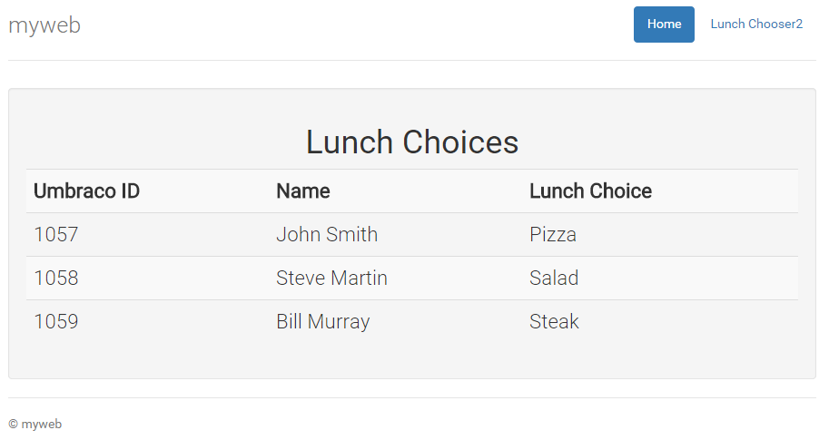

# Umbraco Developer Tutorials

## Beginner Umbraco tutorials for developers

### Tutorial 5 - Adding a Member-side "Admin"
This is Tutorial five in a series of beginner tutorials for Umbraco 7, that create a custom form
in Umbraco.

*   [Tutorial 1 - How to setup Umbraco 7 with Visual Studio](Tutorial-1-Umbraco7-Setup.md)
*   [Tutorial 2 - Creating a webpage](Tutorial-2-Creating-a-Webpage.md)
*   [Tutorial 3 - Creating and Storing Data in Umbraco](Tutorial-3-Storing-Data-in-Umbraco.md)
*   [Tutorial 4 - Creating a Custom Form in Umbraco](Tutorial-4-Creating-a-Custom-Form.md)
*   [Tutorial 5 - Adding a Member-side "Admin"](Tutorial-5-Adding-a-Member-Side-Admin.md)

This tutorial walks you through creating a page to display all the results from submissions of our form on the front side for members of the site (as opposed to the backend Umbraco admin where you can already see the results).

First, let’s create a new page in umbraco for our Lunch Chooser Admin.  To do so, let us create an Admin Page Document Type first.  So click on the Settings icon in the left menu of the Umbraco admin.  Expand out Document Types → Base and then right click on WebPage and select Create.  For the Name call it “AdminPage” and click Create.  You don’t need to change any of the info for the document type, but if you want you can change the icon by clicking on  "Choose.." next to Icon, and then selecting something like a lock and then click Save in the top right corner.

Now you need to allow webpages to have children of the type you just created.  Click on Webpage in the document types list.  Click on the Structure tab, and check the box next to AdminPage in the section labeled "Allowed child node types."  Then click save in the top right corner.

Next click on the Content icon in the menu, right click on Home Page and select Create.  From the list of choices click on AdminPage.  For the page name at the top of the page type "Lunch Admin" and then click Save and publish.  Great, now we have a page at http://myweb/lunch-admin to work with.

Return to Visual Studio, expand out the Views folder, and refresh the folder and you should see AdminPage.cshtml (if not, you need to turn on "Show All Files" by clicking the button in the Solution Explorer menu).  Right click on AdminPage.cshtml and select include in project.  Then double click it to open it up.  We will just let it use the main _Layout.cshtml that we used for the front end just to make this easier.  Here’s the  code to put in the AdminPage.cshtml page, we will discuss it below.

```xml
@inherits Umbraco.Web.Mvc.UmbracoTemplatePage
@using myweb.Models
@using System.Web.Mvc
@{
    Layout = "~/Views/_Layout.cshtml";
}

@{
//Get the content node for the Lunch Chooser so we can get it’s children.
    var contentpage = Umbraco.TypedContentAtXPath("//Webpage/Lunchformpage").FirstOrDefault(x => x.Name == "Lunch Chooser");
    var content = contentpage.Children();

    List<Lunch> items = new List<Lunch>();

    if (content.Any())
    {
        foreach (IPublishedContent item in content)
        {
            items.Add(new Lunch(item));
        }
    }
}
<h1>Lunch Choices</h1>
<table class="table table-striped table-responsive admin">
    <tr>
        <th>Umbraco ID</th>
        <th class="admin">Name</th>
        <th class="admin">Lunch Choice</th>
    </tr>
    @{
        foreach (Lunch item in items)
        {
            <tr>
                <td class="text-left">@item.UmbracoID</td>
                <td class="text-left">@item.FirstName @item.LastName</td>
                <td class="text-left">@item.LunchChoice</td>
            </tr>
        }
    }
</table>
```

The first thing you might see when you insert this code into your AdminPage.cshtml is an error squiggly line for new Lunch(item).  Don’t worry about that, we will fix that below.

Now if we start from the top, the first thing we need to do is get the data from the Umbraco database for the Lunch choices.  This data is attached as children to the Lunch Chooser content page.  So how do we get it?  We can use the Umbraco.TypedContentAtXPath helper to find the content, and "//Webpage/Lunchformpage" as the XPath.  This will traverse the content tree starting at the root and then getting a Webpage (which is our Home Page’s Document Type) and then Lunchformpage (which is our Lunch Chooser page’s Document Type.  If there were multiple Lunchformpage’s under the Home Page then this will return multiple records, so with the command .FirstOrDefault(x => x.Name == "Lunch Chooser"), we can refine this to get the page called "Lunch Chooser."

We now have our Lunch Chooser node, so we next have to get it’s children, which are the lunch form choice submissions.  This is easy:   var content = contentpage.Children();

Next I create a list of Lunch objects and loop through the children we found above and place them into the list of Lunch objects.  We will implement the missing constructor in a minute.  After we have them in a list of Lunch objects it makes them easier to work with and we can output them in a table for display to the end user.

Ok, so what about that missing constructor.  Well, first we need to double check the names of the properties of the data.  In the Umbraco admin go to Settings and expand out Document Types → Base → Data and then click on LunchChoiceData and then click the Generic properties tab.



You’ll notice that the properties are camelcase, firstName, lastName, lunchChoice.  Ok, return to Visual studio and open up Models/Lunch.cs and then update it to look like below.

Models/Lunch.cs
```cs
using System;
using System.ComponentModel.DataAnnotations;
using Umbraco.Core.Models; //Added in Tutorial 5

namespace myweb.Models
{
    public class Lunch
    {
        //Added in Tutorial 5
        public Lunch()
        {
        }

        public Lunch(IPublishedContent content)
        {
            this.FirstName = content.GetProperty("firstName").Value.ToString();
            this.LastName = content.GetProperty("lastName").Value.ToString();
            this.LunchChoice = content.GetProperty("lunchChoice").Value.ToString();
            this.UmbracoID = content.Id;
        }
        //end new in Tutorial 5

        public int UmbracoID { get; set; }
        public string FirstName { get; set; }
        public string LastName { get; set; }
        public string LunchChoice { get; set; }
    }
}
```

This just adds a constructor that will convert an IPublishedContent item to a Lunch object.  This will make things easier to work with in the future.  Save this file and everything should be up and running at this point so open up a browser and go to: http://myweb/lunch-admin

You should see something like:


